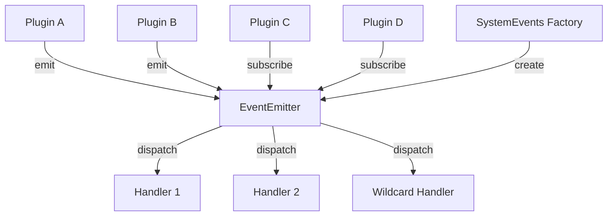
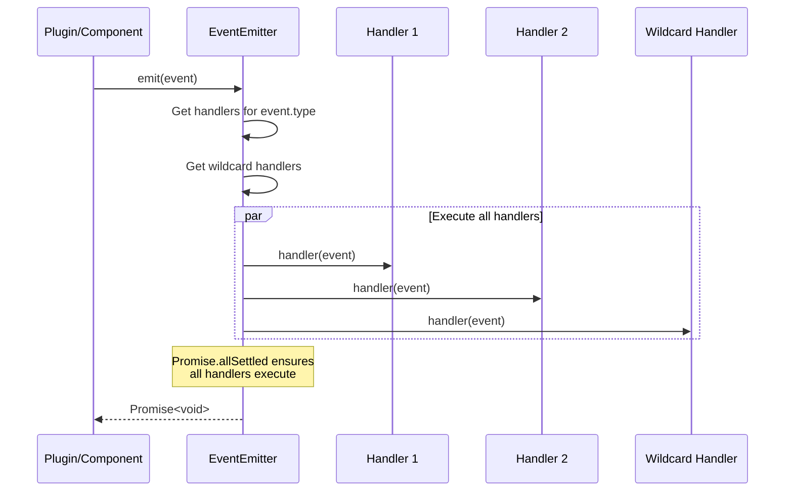

# Design Document

## Overview

The Event System provides a type-safe, decoupled communication mechanism for AgentOS plugins. It implements the Observer pattern with asynchronous event handling, ensuring that plugins can communicate without direct dependencies. The design prioritizes immutability, fault tolerance, and developer experience through TypeScript's type system.

The system consists of three core components:
1. **BaseEvent Interface**: Defines the structure of all events
2. **EventEmitter Class**: Manages subscriptions and dispatches events
3. **SystemEvents Factory**: Creates standardized system-level events

## Architecture

### High-Level Architecture



### Event Flow



## Components and Interfaces

### 1. BaseEvent Interface (base-event.ts)

**Purpose**: Defines the immutable structure for all events in the system.

**Interface Definition**:
```typescript
interface EventMetadata {
  readonly source: string;
  readonly correlationId?: string;
  readonly userId?: string;
}

interface BaseEvent<T = unknown> {
  readonly id: string;
  readonly type: string;
  readonly timestamp: Date;
  readonly payload: T;
  readonly metadata: EventMetadata;
}
```

**Design Decisions**:
- All properties are `readonly` to enforce immutability (Requirement 8)
- Generic type parameter `T` enables type-safe payloads (Requirement 1)
- `metadata.correlationId` is optional to support event correlation across distributed operations
- `metadata.userId` is optional for events not associated with a specific user
- `timestamp` uses Date object for timezone-aware event tracking

**Type Safety**:
- Consumers can define specific payload types: `BaseEvent<UserLoginPayload>`
- TypeScript will enforce payload structure at compile time

### 2. EventEmitter Class (event-emitter.ts)

**Purpose**: Central event bus that manages subscriptions and dispatches events to handlers.

**Class Structure**:
```typescript
type EventHandler<T = unknown> = (event: BaseEvent<T>) => void | Promise<void>;
type UnsubscribeFunction = () => void;

class EventEmitter {
  private handlers: Map<string, Set<EventHandler>>;
  
  constructor();
  on<T = unknown>(eventType: string, handler: EventHandler<T>): UnsubscribeFunction;
  off<T = unknown>(eventType: string, handler: EventHandler<T>): void;
  emit<T = unknown>(event: BaseEvent<T>): Promise<void>;
}
```

**Internal Data Structure**:
- `handlers`: Map where keys are event types (including "*") and values are Sets of handler functions
- Using Set prevents duplicate handler registration
- Map provides O(1) lookup for event type handlers

**Method Implementations**:

**on(eventType, handler)**:
- Adds handler to the Set for the given eventType
- Creates new Set if eventType doesn't exist
- Returns unsubscribe function that removes this specific handler
- Supports "*" as a special wildcard event type (Requirement 5)

**off(eventType, handler)**:
- Removes handler from the Set for the given eventType
- No-op if handler doesn't exist (Requirement 3.3)
- Cleans up empty Sets to prevent memory leaks

**emit(event)**:
- Retrieves handlers for event.type and "*" wildcard
- Combines both sets of handlers
- Executes all handlers using `Promise.allSettled`
- Returns Promise that resolves when all handlers complete
- Failed handlers don't block others (Requirement 4.5)

**Error Handling Strategy**:
- `Promise.allSettled` ensures all handlers execute regardless of failures
- Errors are captured but don't propagate to the emitter
- Future enhancement: Could log errors or emit error events

### 3. SystemEvents Factory (system-events.ts)

**Purpose**: Provides standardized factory methods for creating common system events.

**Class Structure**:
```typescript
class SystemEvents {
  static startup(payload: StartupPayload): BaseEvent<StartupPayload>;
  static shutdown(payload: ShutdownPayload): BaseEvent<ShutdownPayload>;
  static error(payload: ErrorPayload): BaseEvent<ErrorPayload>;
  static stateChange(payload: StateChangePayload): BaseEvent<StateChangePayload>;
  
  private static createEvent<T>(type: string, payload: T, metadata?: Partial<EventMetadata>): BaseEvent<T>;
}
```

**Payload Type Definitions**:
```typescript
interface StartupPayload {
  version: string;
  environment: string;
  startTime: Date;
}

interface ShutdownPayload {
  reason: string;
  graceful: boolean;
}

interface ErrorPayload {
  error: Error;
  context?: Record<string, unknown>;
  severity: 'low' | 'medium' | 'high' | 'critical';
}

interface StateChangePayload {
  from: string;
  to: string;
  reason?: string;
}
```

**Event Type Conventions**:
- `system.startup` - System initialization events
- `system.shutdown` - System termination events
- `system.error` - System-level errors
- `system.stateChange` - System state transitions

**Design Decisions**:
- Static methods for convenience (no need to instantiate)
- Private `createEvent` helper reduces code duplication
- Each method generates UUID using `crypto.randomUUID()` or `uuid` library
- Metadata defaults to `{ source: 'system' }` but can be overridden
- Timestamp is set to current time at event creation

### 4. Module Exports (index.ts)

**Purpose**: Provides clean public API for the event system.

**Exports**:
```typescript
export { BaseEvent, EventMetadata } from './base-event';
export { EventEmitter, EventHandler, UnsubscribeFunction } from './event-emitter';
export { SystemEvents } from './system-events';
export type {
  StartupPayload,
  ShutdownPayload,
  ErrorPayload,
  StateChangePayload
} from './system-events';
```

## Data Models

### Event Lifecycle

1. **Creation**: Event is created with UUID, timestamp, type, payload, and metadata
2. **Emission**: Event is passed to EventEmitter.emit()
3. **Dispatch**: EventEmitter retrieves relevant handlers and executes them
4. **Completion**: Promise resolves when all handlers finish (success or failure)

### Handler Registration Lifecycle

1. **Registration**: Handler is added to EventEmitter via `on()`
2. **Active**: Handler receives events when emitted
3. **Unregistration**: Handler is removed via `off()` or returned unsubscribe function
4. **Cleanup**: Empty handler Sets are removed to prevent memory leaks

## Error Handling

### Handler Execution Errors

**Strategy**: Isolate failures to prevent cascade effects

**Implementation**:
- Use `Promise.allSettled` to execute all handlers
- Capture individual handler failures without propagating
- Continue executing remaining handlers even if some fail

**Future Enhancement**:
- Emit `system.error` events for handler failures
- Provide error callback option in EventEmitter constructor
- Add optional error logging mechanism

### Invalid Event Types

**Strategy**: Fail fast during development, graceful in production

**Implementation**:
- TypeScript types enforce event structure at compile time
- Runtime validation could be added for event type format (dot notation)
- Empty event type strings are technically valid but discouraged

### Memory Leaks

**Strategy**: Automatic cleanup and developer-friendly unsubscribe

**Implementation**:
- Return unsubscribe function from `on()` for easy cleanup
- Remove empty handler Sets when last handler is removed
- Use WeakMap if handler lifecycle needs to be tied to object lifecycle (future enhancement)

## Testing Strategy

### Unit Tests (event-emitter.test.ts)

**Test Coverage Requirements**: >90% code coverage (Requirement 7.1)

**Test Suites**:

**1. BaseEvent Structure Tests**
- Verify all required properties exist
- Verify readonly enforcement (TypeScript compile-time)
- Verify generic type parameter works correctly

**2. EventEmitter Subscription Tests**
- Subscribe to event type and verify handler is called
- Subscribe multiple handlers to same event type
- Verify unsubscribe function removes handler
- Verify `off()` removes specific handler
- Verify `off()` with non-existent handler doesn't throw
- Verify handlers are isolated per event type

**3. EventEmitter Emission Tests**
- Emit event and verify handlers execute
- Emit event with no handlers (should not throw)
- Verify async handlers are awaited
- Verify emit returns Promise that resolves
- Verify event object is passed correctly to handlers

**4. Error Isolation Tests**
- Register handler that throws error
- Register second handler that succeeds
- Verify both handlers execute
- Verify emit Promise resolves despite error
- Verify successful handler receives event

**5. Wildcard Listener Tests**
- Register wildcard handler with "*"
- Emit various event types
- Verify wildcard handler receives all events
- Verify wildcard and type-specific handlers both execute
- Verify wildcard handler unsubscribe works

**6. SystemEvents Factory Tests**
- Verify `startup()` creates correct event structure
- Verify `shutdown()` creates correct event structure
- Verify `error()` creates correct event structure
- Verify `stateChange()` creates correct event structure
- Verify each event has unique UUID
- Verify event types follow naming convention
- Verify timestamps are current
- Verify metadata defaults are applied

**7. Memory Leak Tests**
- Subscribe and unsubscribe many handlers
- Verify internal Map doesn't grow unbounded
- Verify empty Sets are removed

**Test Utilities**:
```typescript
// Mock handler for testing
const createMockHandler = () => {
  const calls: BaseEvent[] = [];
  const handler = (event: BaseEvent) => calls.push(event);
  return { handler, calls };
};

// Async handler for testing
const createAsyncHandler = (delay: number) => {
  return async (event: BaseEvent) => {
    await new Promise(resolve => setTimeout(resolve, delay));
  };
};

// Error-throwing handler for testing
const createErrorHandler = (error: Error) => {
  return (event: BaseEvent) => {
    throw error;
  };
};
```

### Integration Test Scenarios

**Scenario 1: Plugin Communication**
- Plugin A emits user.login event
- Plugin B (auth logger) receives and logs event
- Plugin C (analytics) receives and tracks event
- Verify both plugins process event independently

**Scenario 2: System Lifecycle**
- Emit system.startup event
- Multiple plugins initialize
- Emit system.shutdown event
- Verify graceful cleanup

**Scenario 3: Error Recovery**
- Plugin emits event
- One handler fails
- Other handlers continue processing
- System remains stable

## Performance Considerations

### Handler Execution

**Concurrency**: All handlers execute concurrently via `Promise.allSettled`
- Benefit: Faster overall execution time
- Trade-off: No guaranteed execution order
- Mitigation: Handlers should be independent and idempotent

### Memory Usage

**Handler Storage**: Map<string, Set<EventHandler>>
- Space complexity: O(n) where n is number of unique handlers
- Lookup complexity: O(1) for event type
- Cleanup: Automatic removal of empty Sets

### Event Object Creation

**Immutability**: Events are created as plain objects
- No deep cloning required (handlers can't mutate)
- Lightweight and fast to create
- TypeScript enforces readonly at compile time

## Security Considerations

### Event Payload Validation

**Current Design**: No runtime validation of payloads
- TypeScript provides compile-time type safety
- Future enhancement: Add optional runtime schema validation (e.g., Zod)

### Handler Isolation

**Sandboxing**: Handlers execute in same process
- Malicious handler could block event loop with infinite loop
- Mitigation: Document best practices for handler implementation
- Future enhancement: Add timeout mechanism for handlers

### Metadata Privacy

**User ID Exposure**: Events may contain userId in metadata
- Handlers have access to all event metadata
- Mitigation: Document that sensitive data should not be in metadata
- Future enhancement: Add metadata filtering based on handler permissions

## File Organization

```
src/core/events/
├── base-event.ts           (~50 lines)
├── event-emitter.ts        (~120 lines)
├── system-events.ts        (~100 lines)
├── index.ts                (~15 lines)
└── __tests__/
    └── event-emitter.test.ts (~250 lines)
```

All files remain under 300 lines as required (Requirement 9.1).

## Dependencies

**Required**:
- TypeScript (^5.0.0) - Type system and compilation
- uuid (^9.0.0) - UUID generation for event IDs

**Development**:
- Jest (^29.0.0) - Testing framework
- @types/jest (^29.0.0) - Jest type definitions
- @types/uuid (^9.0.0) - UUID type definitions

## Future Enhancements

1. **Event Replay**: Store events for debugging and replay
2. **Event Filtering**: Allow handlers to specify filter criteria
3. **Priority Handlers**: Execute certain handlers before others
4. **Event Batching**: Batch multiple events for efficiency
5. **Persistent Events**: Store events in database for audit trail
6. **Event Middleware**: Transform events before dispatch
7. **Handler Timeouts**: Prevent slow handlers from blocking
8. **Event Namespacing**: Organize events by domain/module
