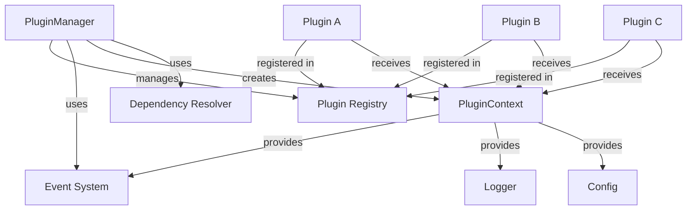
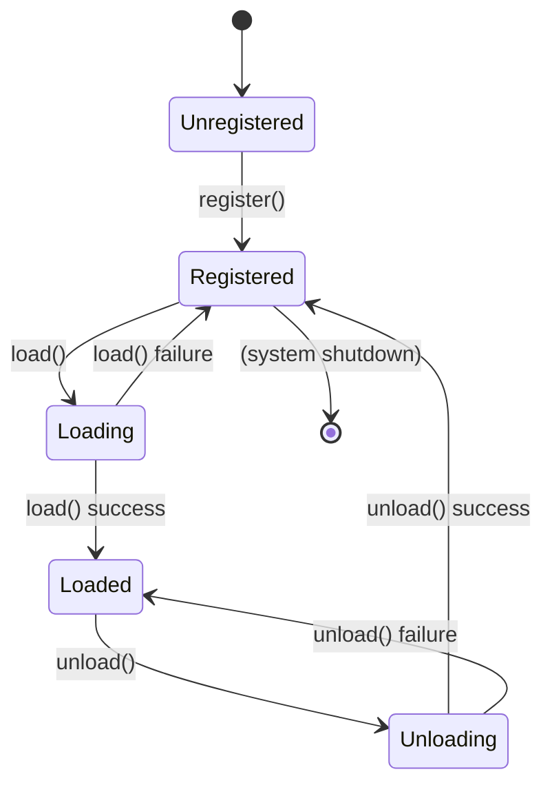
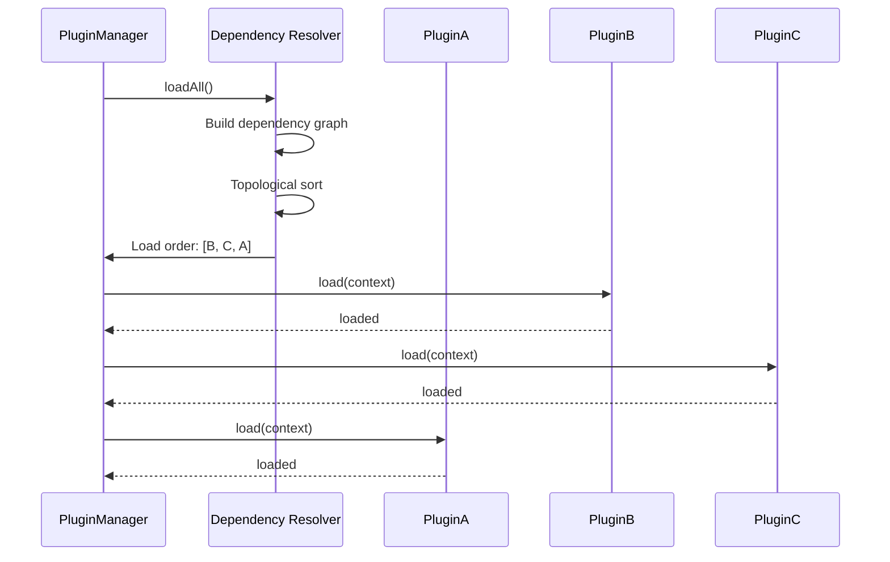

# Design Document

## Overview

The Plugin System provides a robust, type-safe mechanism for extending AgentOS functionality through dynamically loaded plugins. It implements dependency resolution, lifecycle management, and event-driven communication, ensuring plugins can be loaded in the correct order and interact safely with each other and the system.

The system consists of four core components:
1. **Plugin Interface**: Defines the contract for plugins
2. **PluginContext Interface**: Provides runtime services to plugins
3. **PluginManager Class**: Manages plugin registration, loading, and lifecycle
4. **Dependency Resolver**: Handles topological sorting for load order

## Architecture

### High-Level Architecture



### Plugin Lifecycle Flow



### Dependency Resolution Flow



## Components and Interfaces

### 1. Plugin Interface (plugin.ts)

**Purpose**: Defines the contract that all plugins must implement.

**Interface Definition**:
```typescript
interface PluginMetadata {
  readonly name: string;
  readonly version: string;
  readonly description: string;
  readonly dependencies?: string[];
}

interface Plugin {
  readonly metadata: PluginMetadata;
  
  configure?(config: Record<string, unknown>): void | Promise<void>;
  load?(context: PluginContext): void | Promise<void>;
  unload?(): void | Promise<void>;
}
```

**Design Decisions**:
- Metadata is readonly to prevent modification after registration
- All lifecycle methods are optional for flexibility
- `configure()` is called before `load()` to set up plugin configuration
- `load()` receives PluginContext for accessing system services
- `unload()` allows cleanup of resources
- Dependencies are optional array of plugin names

**Usage Pattern**:
```typescript
class MyPlugin implements Plugin {
  metadata = {
    name: 'my-plugin',
    version: '1.0.0',
    description: 'Example plugin',
    dependencies: ['core-plugin']
  };
  
  async load(context: PluginContext) {
    context.logger.info('Plugin loaded');
    context.events.on('some.event', this.handleEvent);
  }
  
  async unload() {
    // Cleanup
  }
}
```

### 2. PluginContext Interface (plugin-context.ts)

**Purpose**: Provides runtime services and environment to plugins.

**Interface Definition**:
```typescript
interface Logger {
  debug(message: string, ...args: unknown[]): void;
  info(message: string, ...args: unknown[]): void;
  warn(message: string, ...args: unknown[]): void;
  error(message: string, ...args: unknown[]): void;
}

interface PluginContext {
  readonly pluginName: string;
  readonly events: EventEmitter;
  readonly logger: Logger;
  readonly config: Record<string, unknown>;
  getPlugin<T extends Plugin>(name: string): T;
}
```

**Design Decisions**:
- `events` provides access to the event system for inter-plugin communication
- `logger` provides structured logging with standard levels
- `config` contains plugin-specific configuration passed during registration
- `getPlugin()` enables plugins to access other loaded plugins with type safety
- All properties are readonly to prevent plugins from modifying the context

**Logger Implementation**:
- Simple console-based logger for MVP
- Can be replaced with more sophisticated logging later
- Includes plugin name in all log messages for traceability

### 3. PluginManager Class (plugin-manager.ts)

**Purpose**: Central manager for plugin registration, loading, and lifecycle.

**Class Structure**:
```typescript
class PluginManager {
  private registry: Map<string, Plugin>;
  private loaded: Map<string, Plugin>;
  private configs: Map<string, Record<string, unknown>>;
  private events: EventEmitter;
  
  constructor(events: EventEmitter);
  
  register(plugin: Plugin, config?: Record<string, unknown>): void;
  load(pluginName: string): Promise<void>;
  loadAll(): Promise<LoadResult>;
  unload(pluginName: string): Promise<void>;
  unloadAll(): Promise<UnloadResult>;
  
  getPlugin<T extends Plugin>(name: string): T;
  isLoaded(name: string): boolean;
  isRegistered(name: string): boolean;
  getLoadedPlugins(): string[];
  getRegisteredPlugins(): string[];
}

interface LoadResult {
  successful: string[];
  failed: Array<{ name: string; error: Error }>;
}

interface UnloadResult {
  successful: string[];
  failed: Array<{ name: string; error: Error }>;
}
```

**Internal Data Structures**:
- `registry`: Map of all registered plugins (name -> Plugin)
- `loaded`: Map of currently loaded plugins (name -> Plugin)
- `configs`: Map of plugin configurations (name -> config)
- `events`: EventEmitter for plugin lifecycle events

**Method Implementations**:

**register(plugin, config?)**:
- Validates plugin has required metadata
- Checks for duplicate plugin names
- Stores plugin in registry
- Stores config if provided
- Emits `plugin.registered` event
- Throws error if plugin name already exists

**load(pluginName)**:
- Checks if plugin is already loaded (no-op if yes)
- Checks if plugin is registered (throws if no)
- Resolves dependencies recursively
- Detects circular dependencies (throws if found)
- Calls plugin.configure() if defined
- Creates PluginContext
- Calls plugin.load(context) if defined
- Adds to loaded map
- Emits `plugin.loaded` event
- Throws error on failure

**loadAll()**:
- Gets all registered plugins
- Performs topological sort based on dependencies
- Loads plugins in sorted order
- Continues on individual failures
- Returns LoadResult with successful and failed plugins
- Emits events for each plugin load

**unload(pluginName)**:
- Checks if plugin is loaded (throws if no)
- Checks if other loaded plugins depend on it (throws if yes)
- Calls plugin.unload() if defined
- Removes from loaded map
- Emits `plugin.unloaded` event
- Throws error on failure

**unloadAll()**:
- Gets all loaded plugins
- Performs reverse topological sort
- Unloads plugins in sorted order
- Continues on individual failures
- Returns UnloadResult with successful and failed plugins

**getPlugin<T>(name)**:
- Checks if plugin is loaded (throws if no)
- Returns plugin instance with type casting
- Enables type-safe plugin access

### 4. Dependency Resolver (dependency-resolver.ts)

**Purpose**: Resolves plugin dependencies and determines load order.

**Class Structure**:
```typescript
class DependencyResolver {
  static resolveDependencies(
    plugins: Map<string, Plugin>,
    startPlugin?: string
  ): string[];
  
  private static buildDependencyGraph(
    plugins: Map<string, Plugin>
  ): Map<string, string[]>;
  
  private static topologicalSort(
    graph: Map<string, string[]>,
    startNode?: string
  ): string[];
  
  private static detectCycles(
    graph: Map<string, string[]>
  ): string[] | null;
}
```

**Algorithm**:
- Uses Kahn's algorithm for topological sorting
- Builds directed acyclic graph (DAG) from dependencies
- Detects cycles using depth-first search
- Returns plugins in load order (dependencies first)

**Cycle Detection**:
- Maintains visited and recursion stack
- Detects back edges indicating cycles
- Returns cycle path for error reporting

**Error Handling**:
- Throws error if missing dependency detected
- Throws error with cycle path if circular dependency found
- Validates all dependencies exist in registry

## Data Models

### Plugin States

```typescript
enum PluginState {
  UNREGISTERED = 'unregistered',
  REGISTERED = 'registered',
  LOADING = 'loading',
  LOADED = 'loaded',
  UNLOADING = 'unloading',
  FAILED = 'failed'
}
```

### Plugin Events

```typescript
interface PluginRegisteredEvent {
  type: 'plugin.registered';
  payload: {
    name: string;
    version: string;
    dependencies: string[];
  };
}

interface PluginLoadedEvent {
  type: 'plugin.loaded';
  payload: {
    name: string;
    loadTime: number; // milliseconds
  };
}

interface PluginUnloadedEvent {
  type: 'plugin.unloaded';
  payload: {
    name: string;
  };
}

interface PluginErrorEvent {
  type: 'plugin.error';
  payload: {
    name: string;
    operation: 'register' | 'load' | 'unload';
    error: Error;
  };
}
```

## Error Handling

### Registration Errors

**Duplicate Plugin Name**:
```typescript
class DuplicatePluginError extends Error {
  constructor(name: string) {
    super(`Plugin '${name}' is already registered`);
    this.name = 'DuplicatePluginError';
  }
}
```

### Loading Errors

**Missing Dependency**:
```typescript
class MissingDependencyError extends Error {
  constructor(plugin: string, dependency: string) {
    super(`Plugin '${plugin}' requires missing dependency '${dependency}'`);
    this.name = 'MissingDependencyError';
  }
}
```

**Circular Dependency**:
```typescript
class CircularDependencyError extends Error {
  constructor(cycle: string[]) {
    super(`Circular dependency detected: ${cycle.join(' -> ')}`);
    this.name = 'CircularDependencyError';
  }
}
```

**Plugin Not Found**:
```typescript
class PluginNotFoundError extends Error {
  constructor(name: string) {
    super(`Plugin '${name}' not found`);
    this.name = 'PluginNotFoundError';
  }
}
```

### Unloading Errors

**Plugin In Use**:
```typescript
class PluginInUseError extends Error {
  constructor(plugin: string, dependents: string[]) {
    super(`Cannot unload '${plugin}': required by ${dependents.join(', ')}`);
    this.name = 'PluginInUseError';
  }
}
```

## Testing Strategy

### Unit Tests

**1. Plugin Interface Tests**
- Verify plugin metadata structure
- Test optional lifecycle methods
- Verify type safety with TypeScript

**2. PluginContext Tests**
- Verify context provides all required services
- Test getPlugin() method
- Test logger functionality
- Verify readonly properties

**3. PluginManager Registration Tests**
- Register plugin successfully
- Reject duplicate plugin names
- Store plugin configuration
- Emit registration events

**4. PluginManager Loading Tests**
- Load plugin without dependencies
- Load plugin with dependencies in correct order
- Detect missing dependencies
- Detect circular dependencies
- Call configure() before load()
- Create and pass PluginContext
- Emit load events
- Handle load failures gracefully

**5. PluginManager Unloading Tests**
- Unload plugin successfully
- Prevent unloading plugin with dependents
- Call unload() method
- Emit unload events
- Handle unload failures gracefully

**6. PluginManager Query Tests**
- Test isLoaded() method
- Test isRegistered() method
- Test getLoadedPlugins() method
- Test getRegisteredPlugins() method
- Test getPlugin() with type safety

**7. Dependency Resolution Tests**
- Resolve simple dependency chain
- Resolve complex dependency graph
- Detect circular dependencies
- Handle missing dependencies
- Topological sort correctness

**8. Integration Tests**
- Load multiple plugins with dependencies
- Unload plugins in reverse order
- Plugin communication via events
- Plugin accessing other plugins
- Full lifecycle: register -> load -> unload

### Test Utilities

```typescript
// Create mock plugin
const createMockPlugin = (
  name: string,
  dependencies: string[] = []
): Plugin => ({
  metadata: {
    name,
    version: '1.0.0',
    description: `Mock plugin ${name}`,
    dependencies,
  },
  load: jest.fn(),
  unload: jest.fn(),
});

// Create plugin with lifecycle tracking
const createTrackingPlugin = (name: string) => {
  const calls: string[] = [];
  return {
    plugin: {
      metadata: { name, version: '1.0.0', description: 'Test' },
      configure: () => calls.push('configure'),
      load: () => calls.push('load'),
      unload: () => calls.push('unload'),
    },
    calls,
  };
};
```

## Performance Considerations

### Plugin Loading

**Dependency Resolution**: O(V + E) where V is plugins, E is dependencies
- Uses topological sort with linear complexity
- Caches dependency graph for repeated loads

**Parallel Loading**: Plugins at same dependency level could load in parallel
- Current design loads sequentially for simplicity
- Future enhancement: parallel loading of independent plugins

### Memory Usage

**Plugin Storage**: O(n) where n is number of plugins
- Registry and loaded maps store plugin references
- Minimal overhead per plugin

### Event System Integration

**Event Overhead**: Each plugin operation emits events
- Minimal performance impact
- Enables monitoring and debugging
- Can be disabled in production if needed

## Security Considerations

### Plugin Isolation

**Current Design**: Plugins run in same process
- No sandboxing or isolation
- Malicious plugin can access all system resources
- Mitigation: Only load trusted plugins

**Future Enhancement**: Plugin sandboxing
- Run plugins in separate processes or workers
- Limit plugin capabilities via permissions
- Implement plugin security policies

### Dependency Validation

**Version Checking**: Not implemented in MVP
- Plugins specify dependency names only
- No version compatibility checking
- Future enhancement: semantic versioning support

## File Organization

```
src/core/plugins/
├── plugin.ts                    (~60 lines)
├── plugin-context.ts            (~80 lines)
├── plugin-manager.ts            (~250 lines)
├── dependency-resolver.ts       (~150 lines)
├── errors.ts                    (~50 lines)
├── index.ts                     (~20 lines)
└── __tests__/
    ├── plugin-manager.test.ts   (~300 lines)
    ├── dependency-resolver.test.ts (~150 lines)
    └── integration.test.ts      (~200 lines)
```

All files remain under 300 lines as required.

## Dependencies

**Required**:
- Event System (from Spec 01) - For plugin communication
- TypeScript (^5.0.0) - Type system

**Development**:
- Jest (^29.0.0) - Testing framework
- @types/jest (^29.0.0) - Jest type definitions

## Integration with Event System

The Plugin System deeply integrates with the Event System:

1. **PluginManager** receives EventEmitter in constructor
2. **PluginContext** provides EventEmitter to plugins
3. **Lifecycle events** emitted for all plugin operations
4. **Plugins** can emit and listen to custom events
5. **System events** can trigger plugin operations

Example integration:
```typescript
const events = new EventEmitter();
const pluginManager = new PluginManager(events);

// Monitor plugin lifecycle
events.on('plugin.loaded', (event) => {
  console.log(`Plugin ${event.payload.name} loaded`);
});

// Plugin can emit events
class MyPlugin implements Plugin {
  async load(context: PluginContext) {
    context.events.emit({
      id: randomUUID(),
      type: 'my-plugin.ready',
      timestamp: new Date(),
      payload: {},
      metadata: { source: 'my-plugin' }
    });
  }
}
```

## Future Enhancements

1. **Plugin Versioning**: Semantic version compatibility checking
2. **Plugin Marketplace**: Registry for discovering and installing plugins
3. **Hot Reload**: Reload plugins without system restart
4. **Plugin Permissions**: Fine-grained access control
5. **Plugin Sandboxing**: Isolate plugins for security
6. **Plugin Configuration Schema**: Validate plugin configs with JSON Schema
7. **Plugin Health Checks**: Monitor plugin health and restart if needed
8. **Plugin Metrics**: Track plugin performance and resource usage
