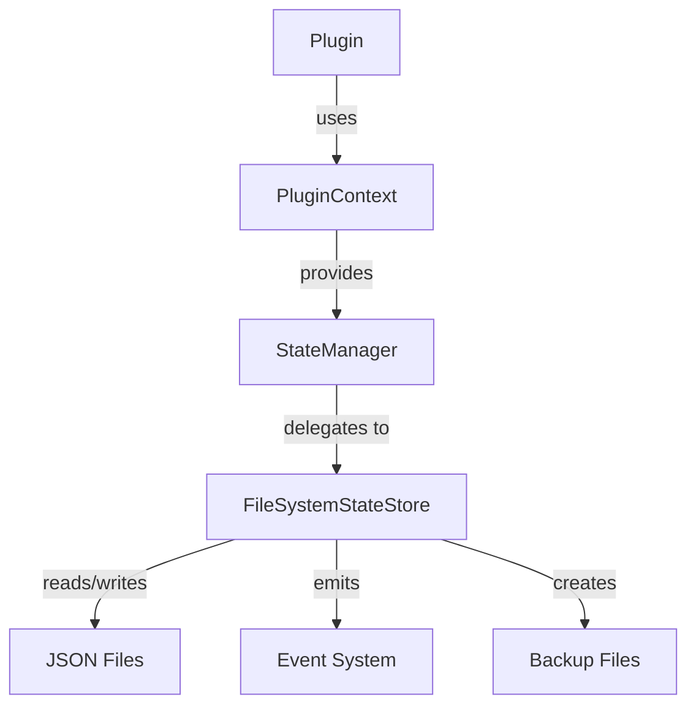

# Design Document

## Overview

The State Management System provides persistent storage for plugin state with versioning, automatic backups, validation, and event-driven notifications. It integrates seamlessly with the Plugin System and Event System to enable plugins to persist data across application restarts while maintaining data integrity and supporting schema evolution.

The system consists of four core components:
1. **StateStore Interface**: Defines the contract for state storage
2. **FileSystemStateStore**: Implements state storage using JSON files
3. **StateManager**: Provides scoped state access for plugins
4. **State Events**: Emits events for all state operations

## Architecture

### High-Level Architecture



### State File Structure

```
.agentos/state/
├── plugin-name.json          # Current state
├── plugin-name.backup.1.json # Most recent backup
├── plugin-name.backup.2.json # Second most recent
└── plugin-name.backup.3.json # Oldest backup
```

### State Data Format

```json
{
  "version": 1,
  "data": {
    "key1": "value1",
    "key2": { "nested": "data" }
  },
  "metadata": {
    "lastModified": "2024-01-01T00:00:00.000Z",
    "pluginName": "my-plugin"
  }
}
```

## Components and Interfaces

### 1. StateStore Interface (state-store.ts)

**Purpose**: Defines the contract for state storage implementations.

**Interface Definition**:
```typescript
interface StateData<T = unknown> {
  version: number;
  data: T;
  metadata: {
    lastModified: Date;
    pluginName: string;
  };
}

interface MigrationFunction<T = unknown> {
  (oldState: T, oldVersion: number): T;
}

interface ValidationFunction<T = unknown> {
  (state: T): boolean;
}

interface StateStore {
  save<T>(pluginName: string, data: T, version?: number): Promise<void>;
  load<T>(pluginName: string): Promise<StateData<T> | null>;
  exists(pluginName: string): Promise<boolean>;
  clear(pluginName: string): Promise<void>;
  
  migrate<T>(
    pluginName: string,
    targetVersion: number,
    migrations: Map<number, MigrationFunction<T>>
  ): Promise<void>;
  
  validate<T>(
    pluginName: string,
    validator: ValidationFunction<T>
  ): Promise<boolean>;
  
  restore(pluginName: string, backupIndex?: number): Promise<void>;
  listBackups(pluginName: string): Promise<string[]>;
}
```

**Design Decisions**:
- Generic type parameter `T` for type-safe state access
- StateData wrapper includes version and metadata
- Migrations are provided as a Map of version -> migration function
- Validation is optional and separate from load
- Backup restoration supports selecting specific backup by index

### 2. FileSystemStateStore Class (filesystem-state-store.ts)

**Purpose**: Implements StateStore using JSON files on the filesystem.

**Class Structure**:
```typescript
interface FileSystemStateStoreOptions {
  stateDir?: string;
  maxBackups?: number;
  prettyPrint?: boolean;
}

class FileSystemStateStore implements StateStore {
  private stateDir: string;
  private maxBackups: number;
  private prettyPrint: boolean;
  private events: EventEmitter;
  private operationQueue: Map<string, Promise<void>>;
  
  constructor(events: EventEmitter, options?: FileSystemStateStoreOptions);
  
  async save<T>(pluginName: string, data: T, version?: number): Promise<void>;
  async load<T>(pluginName: string): Promise<StateData<T> | null>;
  async exists(pluginName: string): Promise<boolean>;
  async clear(pluginName: string): Promise<void>;
  async migrate<T>(...): Promise<void>;
  async validate<T>(...): Promise<boolean>;
  async restore(pluginName: string, backupIndex?: number): Promise<void>;
  async listBackups(pluginName: string): Promise<string[]>;
  
  private getStatePath(pluginName: string): string;
  private getBackupPath(pluginName: string, index: number): string;
  private createBackup(pluginName: string): Promise<void>;
  private rotateBackups(pluginName: string): Promise<void>;
  private queueOperation<T>(key: string, operation: () => Promise<T>): Promise<T>;
}
```

**Internal Data Structures**:
- `stateDir`: Directory where state files are stored (default: `.agentos/state`)
- `maxBackups`: Maximum number of backups to keep (default: 3)
- `prettyPrint`: Whether to format JSON with indentation (default: true)
- `events`: EventEmitter for state operation events
- `operationQueue`: Map to serialize operations per plugin

**Method Implementations**:

**save(pluginName, data, version)**:
1. Queue operation for this plugin to prevent race conditions
2. Check if state file exists
3. If exists, create backup before overwriting
4. Create StateData object with version, data, and metadata
5. Write JSON to file atomically (write to temp file, then rename)
6. Rotate backups if max exceeded
7. Emit `state.saved` event
8. On error, emit `state.error` event and throw StateWriteError

**load(pluginName)**:
1. Queue operation for this plugin
2. Check if state file exists
3. If not exists, return null
4. Read file contents
5. Parse JSON
6. Validate JSON structure
7. Convert metadata.lastModified to Date
8. Emit `state.loaded` event
9. On error, emit `state.error` event and throw StateReadError/StateParseError

**migrate(pluginName, targetVersion, migrations)**:
1. Load current state
2. If no state exists, return (nothing to migrate)
3. Get current version from state
4. If current version >= target version, return (no migration needed)
5. Apply migrations in order from current to target version
6. Save migrated state with new version
7. Emit `state.migrated` event

**validate(pluginName, validator)**:
1. Load current state
2. If no state exists, return true (valid by default)
3. Call validator function with state data
4. Return validation result
5. On error, emit `state.error` event

**createBackup(pluginName)**:
1. Get current state file path
2. Check if state file exists
3. If not exists, return (nothing to backup)
4. Get next backup index
5. Copy state file to backup path
6. Emit `state.backup.created` event

**rotateBackups(pluginName)**:
1. List all backup files for plugin
2. Sort by index (newest first)
3. If count > maxBackups, delete oldest backups
4. Renumber remaining backups to be sequential

### 3. StateManager Class (state-manager.ts)

**Purpose**: Provides scoped state access for plugins through PluginContext.

**Class Structure**:
```typescript
class StateManager implements StateStore {
  private store: StateStore;
  private pluginName: string;
  
  constructor(store: StateStore, pluginName: string);
  
  // All StateStore methods but without pluginName parameter
  async save<T>(data: T, version?: number): Promise<void>;
  async load<T>(): Promise<StateData<T> | null>;
  async exists(): Promise<boolean>;
  async clear(): Promise<void>;
  async migrate<T>(...): Promise<void>;
  async validate<T>(...): Promise<boolean>;
  async restore(backupIndex?: number): Promise<void>;
  async listBackups(): Promise<string[]>;
}
```

**Design Decisions**:
- Wraps StateStore and automatically provides plugin name
- Simplifies plugin code by removing need to pass plugin name
- Implements same interface for consistency
- Created by PluginManager and injected into PluginContext

### 4. Custom Error Classes (errors.ts)

**Error Types**:
```typescript
class StateWriteError extends Error {
  constructor(pluginName: string, cause: Error);
}

class StateReadError extends Error {
  constructor(pluginName: string, cause: Error);
}

class StateParseError extends Error {
  constructor(pluginName: string, cause: Error);
}

class StateValidationError extends Error {
  constructor(pluginName: string, message: string);
}
```

## Data Models

### State Events

```typescript
interface StateSavedEvent {
  type: 'state.saved';
  payload: {
    pluginName: string;
    version: number;
    size: number; // bytes
  };
}

interface StateLoadedEvent {
  type: 'state.loaded';
  payload: {
    pluginName: string;
    version: number;
  };
}

interface StateBackupCreatedEvent {
  type: 'state.backup.created';
  payload: {
    pluginName: string;
    backupPath: string;
  };
}

interface StateMigratedEvent {
  type: 'state.migrated';
  payload: {
    pluginName: string;
    fromVersion: number;
    toVersion: number;
  };
}

interface StateClearedEvent {
  type: 'state.cleared';
  payload: {
    pluginName: string;
  };
}

interface StateErrorEvent {
  type: 'state.error';
  payload: {
    pluginName: string;
    operation: 'save' | 'load' | 'migrate' | 'validate' | 'clear';
    error: Error;
  };
}
```

## Error Handling

### File I/O Errors

**Strategy**: Wrap all file operations in try-catch and emit events

**Implementation**:
- Catch ENOENT (file not found) separately from other errors
- For ENOENT on load, return null instead of throwing
- For other errors, throw custom error with context
- Always emit `state.error` event before throwing

### JSON Parse Errors

**Strategy**: Validate JSON structure after parsing

**Implementation**:
- Try to parse JSON
- Validate required fields (version, data, metadata)
- If validation fails, throw StateParseError
- Include original JSON in error for debugging

### Concurrent Operations

**Strategy**: Queue operations per plugin to prevent race conditions

**Implementation**:
- Maintain Map of plugin name -> Promise
- Before operation, check if operation in progress
- If in progress, wait for it to complete
- Execute operation and store Promise in map
- Remove from map when complete

### Atomic Writes

**Strategy**: Write to temporary file then rename

**Implementation**:
- Write JSON to `{filename}.tmp`
- If write succeeds, rename to `{filename}`
- Rename is atomic on most filesystems
- If rename fails, clean up temp file

## Testing Strategy

### Unit Tests

**1. StateStore Interface Tests**
- Verify interface contract
- Test type safety with TypeScript

**2. FileSystemStateStore Save Tests**
- Save new state
- Overwrite existing state
- Create backup before overwrite
- Rotate backups when limit exceeded
- Handle write errors
- Emit save events

**3. FileSystemStateStore Load Tests**
- Load existing state
- Return null for non-existent state
- Parse JSON correctly
- Convert dates correctly
- Handle read errors
- Handle parse errors
- Emit load events

**4. State Migration Tests**
- Apply single migration
- Apply multiple migrations in sequence
- Skip migration if version current
- Handle migration errors
- Emit migration events

**5. State Validation Tests**
- Validate valid state
- Reject invalid state
- Handle validation errors

**6. State Backup Tests**
- Create backup before save
- Restore from backup
- List backups
- Rotate old backups
- Handle backup errors

**7. State Isolation Tests**
- Verify separate files per plugin
- Verify no cross-plugin access
- Verify filename sanitization

**8. Concurrent Operation Tests**
- Multiple saves to same plugin
- Save and load concurrently
- Verify operations are serialized

**9. StateManager Tests**
- Verify scoped access
- Verify plugin name injection
- Verify all methods work

### Integration Tests

**1. Plugin Integration**
- Plugin saves state
- Plugin loads state on restart
- Plugin migrates state
- Plugin validates state

**2. Event Integration**
- Verify all events emitted
- Verify event payloads correct

**3. Error Recovery**
- Recover from write failure
- Recover from parse error
- Restore from backup

## Performance Considerations

### File I/O

**Async Operations**: All file operations are async
- Non-blocking for application
- Can handle multiple plugins concurrently
- Queue ensures safety per plugin

**Atomic Writes**: Write to temp file then rename
- Prevents partial writes
- Ensures data integrity
- Minimal performance overhead

### Memory Usage

**Streaming**: Not implemented in MVP
- Current implementation loads entire state into memory
- Future enhancement: stream large state files

**Caching**: Not implemented in MVP
- Current implementation reads from disk every time
- Future enhancement: in-memory cache with TTL

### Backup Management

**Lazy Rotation**: Backups rotated during save
- No background process needed
- Minimal overhead
- Configurable max backups

## Security Considerations

### File Permissions

**Current Design**: Uses default Node.js permissions
- State files readable by process owner
- Future enhancement: restrict permissions to 0600

### Path Traversal

**Mitigation**: Sanitize plugin names
- Remove path separators
- Remove special characters
- Validate against whitelist pattern

### State Encryption

**Not Implemented**: State stored as plain JSON
- Future enhancement: encrypt sensitive state
- Use crypto module for encryption
- Store encryption key securely

## File Organization

```
src/core/state/
├── state-store.ts                (~80 lines)
├── filesystem-state-store.ts     (~280 lines)
├── state-manager.ts              (~100 lines)
├── errors.ts                     (~60 lines)
├── index.ts                      (~20 lines)
└── __tests__/
    ├── filesystem-state-store.test.ts (~300 lines)
    ├── state-manager.test.ts          (~150 lines)
    └── integration.test.ts            (~200 lines)
```

All files remain under 300 lines as required.

## Dependencies

**Required**:
- Node.js fs.promises - File system operations
- Event System (from Spec 01) - Event emission
- Plugin System (from Spec 02) - Plugin integration

**Development**:
- Jest - Testing framework
- @types/node - Node.js type definitions

## Integration with Plugin System

The State Management System integrates with the Plugin System through PluginContext:

```typescript
// In PluginManager, create StateManager for each plugin
const stateManager = new StateManager(stateStore, pluginName);

const context: PluginContext = {
  pluginName,
  events,
  logger,
  config,
  state: stateManager, // Add state to context
  getPlugin,
};
```

Plugins can then use state directly:

```typescript
class MyPlugin implements Plugin {
  async load(context: PluginContext) {
    // Load state
    const state = await context.state.load<MyState>();
    
    if (!state) {
      // First run, initialize state
      await context.state.save({ count: 0 }, 1);
    } else {
      // Use existing state
      console.log('Count:', state.data.count);
    }
  }
}
```

## Future Enhancements

1. **State Encryption**: Encrypt sensitive state data
2. **State Compression**: Compress large state files
3. **State Streaming**: Stream large state files instead of loading into memory
4. **State Caching**: In-memory cache with TTL
5. **State Replication**: Replicate state across multiple nodes
6. **State Transactions**: Atomic multi-plugin state updates
7. **State Snapshots**: Create full system snapshots
8. **State Export/Import**: Export state for backup or migration
